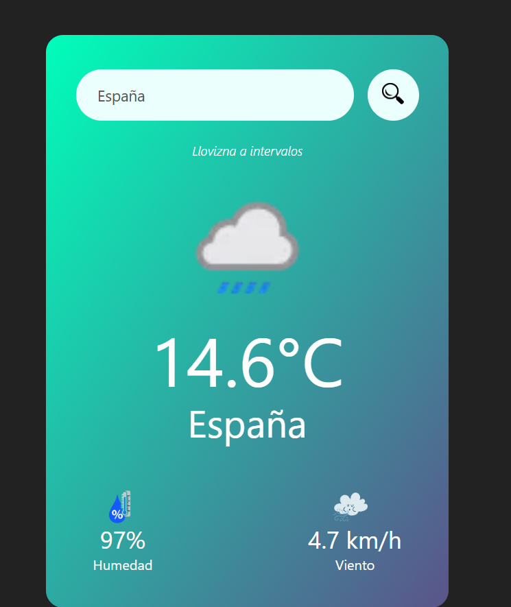

# 🌤️ Temp Tracker

**Temp Tracker** es una aplicación web que permite consultar el clima en tiempo real de cualquier ciudad del mundo utilizando la API de [WeatherAPI](https://www.weatherapi.com/). Desarrollada con tecnologías web modernas, esta herramienta está diseñada para ser rápida, intuitiva y completamente responsive.

## 📌 Características principales

- Búsqueda por nombre de ciudad 🌍
- Datos en tiempo real: temperatura, humedad, sensación térmica, velocidad del viento y más 🌡️
- Interfaz limpia y responsive, adaptable a móviles y escritorios 📱💻
- Manejo de errores para ciudades no válidas o sin conexión 🔧
- Diseño moderno e intuitivo, ideal para fines educativos 🎓

## 🛠️ Tecnologías utilizadas

- HTML5
- CSS3 (con diseño responsivo)
- JavaScript ES6+
- [WeatherAPI](https://www.weatherapi.com/) para la obtención de datos climáticos

## 📷 Capturas de pantalla

> 

## ⚙️ ¿Cómo usar Temp Tracker?

1. Clona este repositorio:
   ```bash
   git clone https://github.com/DanielitoQ/Temp-Tracker.git
   ```
